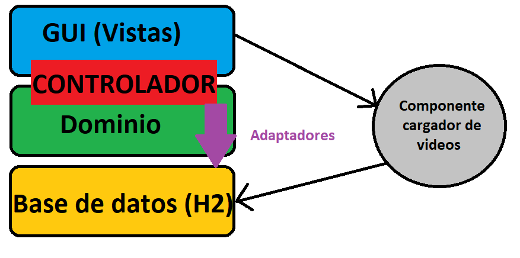

# Diagrama de clases del dominio


# Diagrama de interacción para añadir video al playlist

  


# Arquitectura y diseño de la aplicación

La aplicación consta de 46 clases para las ventanas que formarán parte de la capa de vistas (paguete `gui`), los adaptadores para las diferentes entidades que se guardan en persistencia (paquete `dao`), las clases del dominio (paquete `model`), el lanzador (paquete `laucher`) y el controlador `AppVideo` (paquete `controller`). En la parte de GUI tenemos diversas clases desarrolladas mas alla de las propias ventanas como Utils, nuevos Layouts y previews para mostrar los videos y las playlist.





Otro elemento a mencionar es el componente cargador de videos, que consta de 6 clases, 5 ya venian dadas y la sexta es el componente java bean al cual hemos llamado `VideosLoader`, el cual utilizando el patron Observer carga los videos de un XML dado y notifica a los oyentes con los videos que ha cargado. 


# Patrones de diseño


## Patrones de diseño utilizados directamente


La mayoría de los patrones los hemos usado en el servicio de persistencia:


  - Patrón DAO. Usado para persistir usuarios, videos y playlist.
  - Patrón adaptador. Usado con el servicio de persistencia para que la aplicación dependa de una interfaz con los métodos para acceder al servicio de persistencia.
  - Patrón factoría abstracta. Usado también con el servicio de persistencia.
  - Patrón singleton. Usado en los repositorios, en el servicio de persistencia, en el controlador tambien para `VideoWeb`
  - Patrón fachada. Usado en el controlador (`controller`).
  - Patrón observer, para cargar nuevo videos, para modificar playlist, videos o aplicar filtros y notificar el cambio al panel `MyPlaylistPanel` y `HomePanel`.
  - Patrón estrategia, para poder aplicar filtro dinamicamente sin tener que implementar el filtro en  el controlador.


## Patrones de diseño utilizados indirectamente


Los patrones de diseño que hemos usado indirectamente al usar Java AWT, Swing y los botones, listas y el desarrollo de las ventanas gráficas son:


  - Patrón bridge.
  - Patrón adaptador.
  - Patrón composite.
  - Patrón decorador.
  - Patrón estrategia.
  - Patrón iterador.
  - Patrón observer.


#  Explicación sobre los componentes utilizados


El primer componente usado en nuestra aplicación llamado `luz` se puede encontrar en la ventana `AppVideoWindow`, en concreto en `HomePanel`, es un componente sencillo que al ser pulsado emite una luz de un color, en nuestro caso hemos puesto un color amarillo como luz, y a continuacion se abre un selector de archivos en el que debes seleccionar el `XML` en el que se encuentras las canciones, en nuestro caso se llama `videos.xml`. Una vez seleccionado el archivo el botón vuelve a su estado por defecto y deja de estar pulsado.

El segundo componente está directamente relacionado con este componente `luz`, el cual hemos visto que su funcionalidad es elegir un archivo `xml` donde estan los videos que queremos cargar, tras elegir ese archivo hacemos uso de este segundo componente llamado `VideosLoader`, el cual pasandole este archivo `xml` como parametro carga los videos haciendo un mapeo de `xml` a `java`. Una vez cargados los videos por el componente notifica al oyente haciendo uso del patron observer, en este caso `controller` (el controlador) con los videos cargados.


Tambien usamos componente `VideoWeb` que nos permite visualizar videos de YouTube mediante `JavaFX`.


Para poder comunicar con el base de dato, usamos `DriverPersistencia` que en este caso usamos `H2`.


Para la generación de PDF, hemos usado `itextpdf`, para extraer el nombre base del fichero, hemos usado `commons-io` para poder hacerlo en multiple plataforma (Lo podríamos hacer con regex tambien).


Para *"Look&Feel"* de swing, hemos optado por un tema plano y moderno, `flatlaf`, que permite cambiar los colores con un fichero *json*.


Para los test unitarias, hemos usado `JUnit`.

# Tests unitarios implementados
Se han implementado diversos test unitarios:

## Test para el controlador

### AppVideoTest

  Se han testeado diversas funciones que se encuentran en el constructor:

  - `login`: se comprueba que un usuario puede loguearse correctamente.
  - `isUserRegistered`: se comprueba si la funcion que comprueba si un usuario ya esta registrado funciona correctamente.
  - `setPremium`: se comprueba si un usuario se hace premium.
  - `registerUser`: se comprueba que funciona correctamente el registro de usuarios.
  - `setNightMode`: se comprueba que se pone bien el nightMode.
  - `applyFilter`: se comprueba que se aplica un filtro correctamente.
  - `persistVideo`: se comprueba la funcionalidad de persistir un video.
  - `createPlaylist`: se comprueba la funcionalidad de crear una playlist.
  - `removePlaylist`: se comprueba la funcionalidad de borrar una playlist.

## Test para persistencia

### DAOTest

Se comprueba la correcta creacion de las entidades `User` y `Video` en persistencia y el correcto funcionamiento de la actualización de las mismas.

  - `createUser`
  - `updateUser`
  - `createVideo`  
  - `updateVideo`

### DAOUtilsTest

Se comprueba el correcto funcionamiento de algunas funciones utiles para la persistencia como:

  - `stringToList`  
  - `listToString`  
  - `safeValueOf`  

# Un breve manual de usuario que explique cómo usar la aplicación

Antes de ejecutar la aplicación, debemos iniciar el base de dato H2 que se encuentra en la ruta del proyecto.

```bash
java -jar ServidorPersistenciaH2.jar
```


## Ventana de login

La ventana de login, que el es primer ventana que se sale al incial el programa, podemos hacer **login** o ir al ventana de **registrar**.


Al hacer un login exitoso, el campo de contraseña se pone con fondo verde para indicar que el usuario y la contraseña son correctos.


## Ventana de registro

Podemos registra en está venta un nuevo usuario rellenando los datos que necesita.


Al dar el botón de *Registrar*:


Se registrar correctamente si no existe otro usuario con el mismo nombre de usuario y que la contraseña es valida.


## Ventana principal


Al hacer el login en el sistema, entramos en la ventana principal del programa:


En el menu, podemos editar nuestro perfil, donde podemos cambiar los datos de nuestro usuario y hacer que el usuario sea ***premium***


Si sosmos usuario premium, podemos aplicar filtros:


En el menu de *Settings* podemos cambiar el tema al **Modo nocturno**:


### Home

#### Buscar video

Para la pestña *Home*, podemos buscar videos por el titulo:


O filtrar video que tiene uno de las etiquetas seleccionadoa (Solo se realiza la busqueda al pulsar el boton de *Buscar Video*):


#### Añadir nuevo video con xml

**Se puede añadir nuevos videos al sistema con el botón de *Luz***, que se mantiene encendido hasta que termina la operación de carga de video.


### Visualizar video

Se puede visualizar video, haz click al video que quiere reproducir y se abre en un nuevo ventana [Visualizador de Video](#VideoPlayer)


### Recientes

En la pestaña de recientes, la función que tiene es muy simple, **contiene la lista de 5 videos visto más recientes** que podrá ser visualizado al hacer click en el video que se abre [Visualizador de Video](#VideoPlayer).


### Mis Playlists

En este pestaña, el usuario puede visualizar todas sus lista de reproducción que tiene guardado, se puede [visualizar el video](#VideoPlayer) haciendo click sobre ellos .


### Crear Playlists

En la pestaña de *Crear Playlist*, que al principio está vacía, podemos **Seleccionar Playlist** existente o podemos **Crear Playlist**. 


Una vez que tenemos seleccionado un playlist, tenemos una vista previa de la playlist, donde podemos ver el titulo de la playlist que en éste caso es `Tecnologia` y podemos reproducir el video haciendo el click sobre él.


Haciendo click en *Editar Playlist*, podemos abrir el editor de playlist que explicamos a continuación.


#### Editor de playlist

En el editor podemos buscar video por su nombre o filtrar por etiquetas similar al de pestaña *Home*,  Borrar Playlist actual o guardar la selección.


### Tendencias

Para los usuarios premium, existe un pestaña de *Tendencia* que permite tener una lista de los 10 videos más visualidado en nuestro sistema.


## Editor del perfil

Este ventana que se puede acceder mediante `Perfil-Editar`  en la barra de menu de la ventana principal, permite consultar los estados del usuario y cambiar sus datos.


Otra función importante es generar pdf para los usuarios premium, para generar el pdf, basta con dar al botón de *Generar PDF* y  seleccionar el lugar y el nombre que tenga el pdf final.


Una vez generado el pdf, tiene lo siguiente formado:


## Visualizador de video


En el visualizador del video, podemos añadil etiqueta y borrar etiqueta haciendo click en la etiqueta que quiere borrar.


# Observaciones finales

Esta práctica nos ha enseñado a enfrentarnos a un proyecto de gran envergadura, por lo menos en comparación de todas las prácticas anteriores realizadas en la carrera, perfectamente podría tratarse una aplicación comercial, más allá de que es mejorable en diversos aspectos, si fuese una aplicación que tuviese que competir en el mercado de hoy en día, obviando eso AppVideo se parece a una aplicación real.


A la hora del desarrollo hemos tenido errores a la hora de como afrontar el diseño software de ciertas partes del programa como la implementacion del componente `VideosLoader` a la hora de hacer uso de el junto al componente `Luz`, pero que hemos solucionado. También hemos tenido que aplicar mucho refactoring **a lo largo de todo el desarrollo**, una vez mas por temas de diseño a la hora de revisar que no incumpliese los patrones `GRASP`, de que se respetase el patrón `modelo-vista`. 

También de como llevar a cabo ciertas funcionalidades como crear playlist y editarlas, ya que hay varias formas de hacerlo. En resumen, decisiones de diseño que hemos ido tomando y cambiando a lo largo del desarrollo que nos ha llevado muchas horas de refactorización.


Otro punto importante es que en `VideoWeb`, al usar el constructor se llama al bloque estatico que crashea el programa cuando lo inicializa más de una vez, lo que al final lo resolvimos con singleton.


## Conclusiones

Hemos aprendido mucho sobre patrones de diseño y desarrollo software en general realizando este práctica. Hemos aprendido a utilizar swing, a diseñar interfaces gráficas, la separacion en capas de la aplicacion (`modelo-vista`), adaptadores, factorias abstractas y patrón `dao` para usar la base de datos, uso de `layouts`, etc.


## Horas estimadas


|       Alumnos       | Jose Luis Sanchez Carrasco | Mengchen Huang |
| :-----------------: | :------------------------: | :------------: |
|         GUI         |             60             |       65       |
|       Modelo        |             15             |       5        |
|    Persistencia     |             10             |       15       |
|     Componentes     |             5              |       4        |
| Refactoring/Mejoras |             70             |       80       |
|        Utils        |             2              |       5        |
|       Memoria       |             5              |       5        |
|   Horas estimadas   |            167             |      179       |
